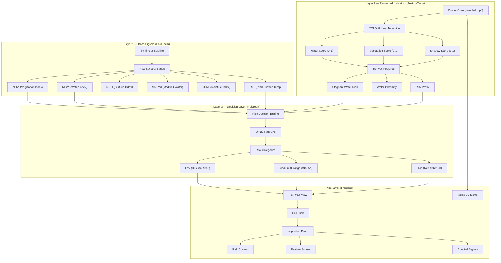
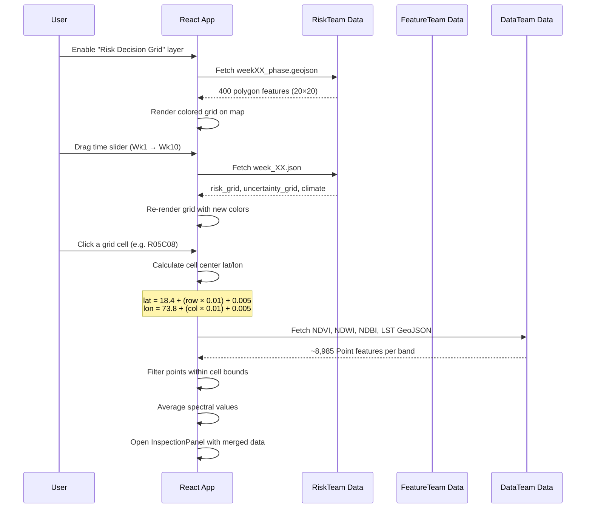
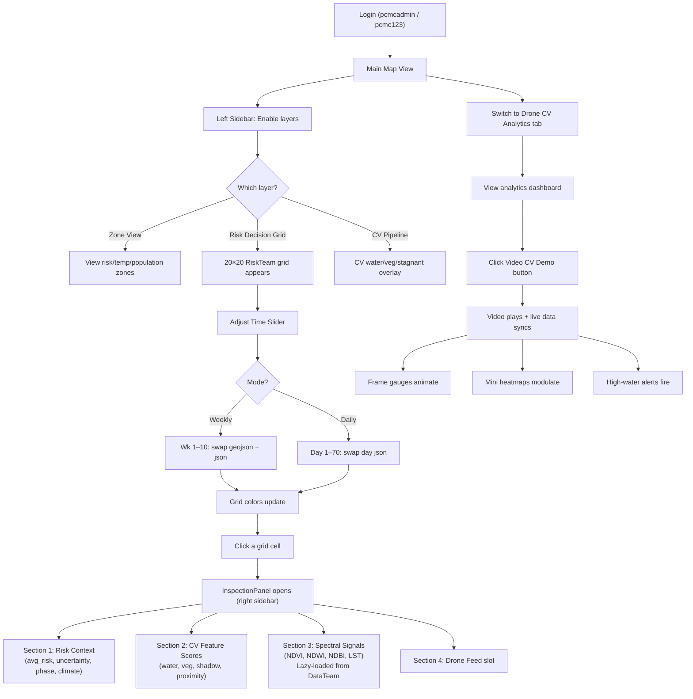

# Mosquito Risk Monitoring MVP — Integration Guide & System Architecture

## Complete Implementation Walkthrough

---

## 1. System Architecture Overview

The system follows a **three-layer pipeline architecture** where each team's data feeds into the next layer, ultimately producing actionable risk decisions:



---

## 2. Data Flow Architecture



---

## 3. Feature-by-Feature Proof of Concept

### 3.1 Risk Decision Grid (RiskTeam Layer)

**What it does**: Overlays a 20×20 colored grid covering Pune city (~18.40°N–18.60°N, 73.80°E–73.99°E) on the Leaflet map.

**Data source**: `public/data/riskteam/weekXX_phase.geojson` (10 files, 400 features each)

**Color mapping formula** (from PDF spec):
```
risk_category = 0 → Blue  (#4393c3) → "Low"
risk_category = 1 → Orange (#f4a35a) → "Medium"  
risk_category = 2 → Red    (#d6312b) → "High"
```

**Grid cell coordinate formula**:
```
Cell center latitude  = 18.4 + (row × 0.01) + 0.005
Cell center longitude = 73.8 + (col × 0.01) + 0.005
Cell size = 0.01° × 0.01° (approximately 1.1 km × 1.1 km)
```

**Implementation**: [RiskMap.tsx](file:///e:/unoff_app/src/app/components/RiskMap.tsx#L547-L640)

```typescript
// RiskTeam color mapping per PDF spec
function getRiskGridColor(category: number): string {
  switch (category) {
    case 2: return '#d6312b'; // High - Red
    case 1: return '#f4a35a'; // Medium - Orange
    case 0: return '#4393c3'; // Low - Blue
    default: return '#94a3b8';
  }
}
```

**GeoJSON feature properties consumed**:
```json
{
  "cell_id": "R00C00",
  "row": 0, "col": 0, "week": 1,
  "avg_risk": 0.48,
  "risk_category": 1,
  "risk_category_label": "Medium",
  "phase": "pre"
}
```

**How to use**: 
1. In the left sidebar → scroll to "Risk Decision Grid" category
2. Check the "Risk Decision Grid" checkbox
3. The 20×20 grid appears on the map covering Pune
4. Click any cell to open the Inspection Panel

---

### 3.2 Time Slider (Weekly/Daily Mode)

**What it does**: Controls the temporal dimension of the risk grid, allowing users to see how risk evolves over time.

**Two modes**:

| Mode | Range | Data Source | Slider Resolution |
|:---|:---|:---|:---|
| **Weekly** | Wk 1 – Wk 10 | `week_XX.json` + `weekXX_phase.geojson` | 10 positions |
| **Daily** | Day 1 – Day 70 | `day_XXX.json` | 70 positions |

**Climate data displayed** (from each JSON):
```json
{
  "climate": {
    "temperature_c": 28.0,   // °C
    "rainfall_mm": 5.0,      // mm
    "humidity_pct": 55.0     // %
  }
}
```

**Intervention detection** — reactive alerts:
```typescript
// When intervention.triggered === true in the JSON:
if (riskTimeData?.intervention?.triggered) {
  // Shows "⚠ Intervention Active" badge on slider
}
```

**Phase indicator**:
- Week 1: `"pre"` (Pre-Treatment / Early surveillance)
- Weeks 2–10: `"post"` (Post-Treatment / Active monitoring)

**How to use**:
1. Enable the Risk Decision Grid layer
2. The slider shows "Weekly" and "Daily" toggle buttons
3. Click "Daily" for fine-grained 70-day view
4. Drag the slider — grid re-renders, climate data updates
5. Red "Intervention Active" badge appears when triggered

---

### 3.3 Inspection Panel (Merged Three-Team View)

**What it does**: When a risk grid cell is clicked, a persistent side panel opens showing data from **all three teams** merged by location.

**Component signature**:
```tsx
<InspectionPanel
  selectedCell={{ row: 5, col: 8, cell_id: "R05C08", lat: 18.455, lon: 73.885 }}
  riskData={{
    avg_risk: 0.48,                    // From RiskTeam
    risk_category_label: "Medium",
    uncertainty: 0.0211,
    phase: "pre",
    climate: { temperature_c: 28, rainfall_mm: 5, humidity_pct: 55 },
    intervention: { triggered: false, reason: "Monitoring...", zones: [] }
  }}
  featureData={{                        // From FeatureTeam
    water: 0.72, vegetation: 0.35, shadow: 0.18,
    water_proximity: 0.80, risk_proxy: 0.65
  }}
  onClose={() => {}}
  videoUrl={null}                       // Drone feed slot
/>
```

**Panel sections**:

| Section | Data Source | What it shows |
|:---|:---|:---|
| **Risk Context** | RiskTeam `week_XX.json` | Avg risk %, uncertainty %, phase, climate (temp/rain/humidity), intervention status |
| **CV Feature Scores** | FeatureTeam `cv-geojson.json` | Water, Vegetation, Shadow, Water Proximity, Risk Proxy — as color-coded progress bars |
| **Spectral Signals** | DataTeam `{band}_{date}.geojson` | NDVI, NDWI, NDBI, MNDWI, NDMI, LST — loaded lazily |
| **Drone Feed** | Video URL prop | `<video>` player or placeholder |

**Implementation**: [InspectionPanel.tsx](file:///e:/unoff_app/src/app/components/InspectionPanel.tsx)

---

### 3.4 Spectral Data Loader (DataTeam Integration)

**What it does**: Lazy-loads Sentinel-2 spectral GeoJSON files (~4.5 MB each, 8,985 Point features) and extracts per-cell averaged band values.

**Spatial filter formula**:
```typescript
// For a cell at (cellLat, cellLon) with cellSize = 0.01°:
const halfCell = 0.005; // 0.01 / 2

// A spectral point at (lon, lat) is "inside" the cell if:
lat >= cellLat - halfCell  &&  lat <= cellLat + halfCell
lon >= cellLon - halfCell  &&  lon <= cellLon + halfCell
```

**Averaging formula**:
```
bandValue = Σ(feature.properties.features[bandKey]) / numFeaturesInCell
```

**Spectral band normalization for display**:
```typescript
// NDVI, NDWI, NDBI, MNDWI, NDMI range from -1 to +1
barPct = ((value + 1) / 2) * 100   // Maps [-1,1] → [0%,100%]

// LST (Land Surface Temperature) ranges from 0°C to ~50°C
barPct = (value / 50) * 100        // Maps [0,50] → [0%,100%]
```

**Band meanings**:

| Band | Full Name | Range | What High Values Mean |
|:---|:---|:---|:---|
| **NDVI** | Normalized Difference Vegetation Index | -1 to 1 | Dense vegetation (potential larval habitat) |
| **NDWI** | Normalized Difference Water Index | -1 to 1 | Standing water bodies |
| **NDBI** | Normalized Difference Built-up Index | -1 to 1 | Built-up urban areas |
| **MNDWI** | Modified NDWI | -1 to 1 | Better water detection in urban areas |
| **NDMI** | Normalized Difference Moisture Index | -1 to 1 | Soil/vegetation moisture content |
| **LST** | Land Surface Temperature | 0–50°C | Higher temps favor mosquito breeding |

**Caching**: Files are cached in-memory after first load — subsequent cell clicks re-use cached data.

**Implementation**: [spectral-loader.ts](file:///e:/unoff_app/src/app/data/spectral-loader.ts)

---

### 3.5 CV Pipeline Integration (FeatureTeam)

**Already integrated** — the Drone CV Analytics tab shows:

**Detection pipeline**:
```
Drone Video → Frame Extraction (every 30th frame) 
→ HSV Color Analysis + Laplacian Texture 
→ YOLOv8 Nano Object Detection 
→ Per-frame scores (water, vegetation, shadow)
→ Grid cell aggregation → GeoJSON output
```

**Feature scoring formula** (from the CV pipeline):
```
water_score      = HSV blue-range pixel ratio + texture smoothness
vegetation_score = HSV green-range pixel ratio + NDVI-like calculation
shadow_score     = HSV low-value pixel ratio + low saturation
```

**Derived features**:
```
stagnant_water    = water_score × (1 - flow_indicator) × proximity_factor
water_proximity   = gaussian_weighted_distance_to_nearest_water_cell
risk_proxy        = 0.4 × water + 0.3 × stagnant_water + 0.2 × vegetation + 0.1 × shadow
```

**Grid heatmap color thresholds**:
```typescript
// Water detection
≥ 0.7 → Dark Blue  (#1e40af)
≥ 0.5 → Blue       (#3b82f6)
≥ 0.3 → Light Blue (#93c5fd)
< 0.3 → Pale Blue  (#dbeafe)

// Vegetation density
≥ 0.7 → Dark Green  (#15803d)
≥ 0.5 → Green       (#22c55e)
≥ 0.3 → Light Green (#86efac)
< 0.3 → Pale Green  (#dcfce7)

// Stagnant water risk
≥ 0.7 → Red    (#dc2626)
≥ 0.5 → Orange (#f97316)
≥ 0.3 → Yellow (#fbbf24)
< 0.3 → Cream  (#fef3c7)
```

**Map overlay**: Available as three separate layer toggles:
- CV Water Detection
- CV Vegetation
- CV Stagnant Water Risk

---

### 3.6 Video CV Demo

**What it does**: Plays the real drone survey video (`sample4.mp4`, 13 MB) with synchronized CV pipeline data visualization.

**Video-to-frame sync formula**:
```typescript
// Map CV pipeline frame index to video timestamp:
videoCurrentTime = (frameIndex / totalFrames) * videoDuration

// Example: Frame 12 of 24 total, video is 60 seconds:
// videoCurrentTime = (12/24) * 60 = 30 seconds
```

**Playback speed control**:
```typescript
// Frame advance interval (milliseconds):
interval = 1500 / playbackSpeed

// 0.5x → 3000ms per frame (slow)
// 1.0x → 1500ms per frame (normal)  
// 2.0x → 750ms per frame (fast)
```

**Animated heatmap modulation**:
```typescript
// Grid values modulate sinusoidally based on frame position:
animFactor = 0.8 + 0.4 × sin((frameIndex / totalFrames) × π)
displayValue = min(1.0, baseValue × animFactor)
```

**High water alert threshold**:
```typescript
if (frameData.water >= 0.70) {
  // Show red alert: "⚠ High Water Detected"
  // Indicates potential stagnant water breeding site
}
```

**Layout**: 3:2 split screen
- **Left (60%)**: Video player + playback controls + frame gauges
- **Right (40%)**: Pipeline status + detection alerts + spatial heatmaps + frame history

**How to use**:
1. Navigate to "Drone CV Analytics" tab
2. Click the green "Video CV Demo" button
3. Press Play — video and data animate in sync
4. Use speed controls (0.5x / 1x / 2x)
5. Click individual frame bars in the history chart to jump
6. Watch for red alerts on high-water frames

**Implementation**: [VideoCVDemo.tsx](file:///e:/unoff_app/src/app/components/VideoCVDemo.tsx)

---

## 4. Complete User Workflow (Step-by-Step)



### Workflow Narrative

1. **Login** → Enter `pcmcadmin` / `pcmc123` to access the PCMC view

2. **Enable Risk Decision Grid** → In the left sidebar, scroll down and check "Risk Decision Grid". A 20×20 colored grid (Blue/Orange/Red) appears over Pune.

3. **Explore time** → The bottom slider now shows Weekly/Daily toggle. Drag from Week 1 (pre-treatment) to Week 10 (post-treatment) and watch the risk landscape evolve. Climate indicators (temperature, rainfall, humidity) update in real-time.

4. **Click a cell** → Click any grid cell (e.g., R05C08). The InspectionPanel opens on the right showing:
   - **Risk Context**: 48.0% risk, Medium category, Pre-Treatment phase
   - **CV Feature Scores**: Water 72%, Vegetation 35%, Stagnant Risk proxy
   - **Spectral Signals**: NDVI=0.4278, NDWI=0.1234, LST=32.5°C (loaded lazily from 4.5 MB GeoJSON files)

5. **Watch for interventions** → As you drag the slider past the intervention trigger day, a red "⚠ Intervention Active" badge appears, indicating the system switched from surveillance to active treatment.

6. **Video CV Demo** → Switch to "Drone CV Analytics" tab → click "Video CV Demo". The real drone footage (`sample4.mp4`) plays alongside live-updating gauges, spatial heatmaps, and detection alerts. Water scores above 70% trigger breeding site warnings.

---

## 5. File Architecture

```
e:/unoff_app/
├── public/data/
│   ├── riskteam/           ← RiskTeam static data
│   │   ├── week01_pre.geojson      (400 polygon features)
│   │   ├── week02_post.geojson     ... through week10
│   │   ├── week_01.json            (risk_grid 20×20, climate, intervention)
│   │   ├── week_10.json            ... through week10
│   │   ├── day_001.json            (daily granularity)
│   │   └── day_070.json            ... through day70
│   ├── datateam/           ← DataTeam spectral samples
│   │   ├── ndvi_2025-01-03.geojson (8,985 Point features, ~4.5 MB)
│   │   ├── ndwi_2025-01-03.geojson
│   │   ├── ndbi_2025-01-03.geojson
│   │   ├── mndwi_2025-01-03.geojson
│   │   ├── ndmi_2025-01-03.geojson
│   │   └── lst_2025-01-29.geojson
│   └── videos/
│       └── sample4.mp4     ← Real drone survey footage (13 MB)
│
├── src/app/
│   ├── components/
│   │   ├── RiskMap.tsx      ← Risk grid overlay + time slider (MODIFIED)
│   │   ├── InspectionPanel.tsx  ← 3-team merged cell detail panel (NEW)
│   │   ├── VideoCVDemo.tsx      ← Video + synced pipeline data (NEW)
│   │   ├── DroneAnalytics.tsx   ← Added Video CV Demo toggle (MODIFIED)
│   │   ├── LayerControl.tsx     ← Added Risk Decision Grid toggle (MODIFIED)
│   │   └── App.tsx              ← Wired InspectionPanel (MODIFIED)
│   └── data/
│       ├── spectral-loader.ts   ← DataTeam GeoJSON lazy loader (NEW)
│       └── cv-pipeline/         ← FeatureTeam data (pre-existing)
│           ├── cv-scores.json
│           ├── cv-grid-features.json
│           ├── cv-roc-summary.json
│           └── cv-geojson.json
│
└── integrate/              ← Source team data (not bundled)
    ├── DataTeam/Lotus_Organized/{year}/Month_{mm}/{band}/
    ├── RiskTeam/ (70 daily + 10 weekly JSONs + 10 GeoJSONs)
    └── integrated CV/ (pipeline code + raw videos)
```

---

## 6. Key Formulas Summary

| Formula | Purpose | Code Location |
|:---|:---|:---|
| `lat = 18.4 + (row × 0.01) + 0.005` | Cell → Lat conversion | [RiskMap.tsx:L604](file:///e:/unoff_app/src/app/components/RiskMap.tsx#L604) |
| `lon = 73.8 + (col × 0.01) + 0.005` | Cell → Lon conversion | [RiskMap.tsx:L605](file:///e:/unoff_app/src/app/components/RiskMap.tsx#L605) |
| `barPct = ((value + 1) / 2) × 100` | Spectral [-1,1] → [0%,100%] | [InspectionPanel.tsx:L86](file:///e:/unoff_app/src/app/components/InspectionPanel.tsx#L86) |
| `barPct = (value / 50) × 100` | LST [0,50°C] → [0%,100%] | [InspectionPanel.tsx:L84](file:///e:/unoff_app/src/app/components/InspectionPanel.tsx#L84) |
| `videoTime = (frame / total) × duration` | Frame → video sync | [VideoCVDemo.tsx:L106](file:///e:/unoff_app/src/app/components/VideoCVDemo.tsx#L106) |
| `interval = 1500 / speed` | Playback speed control | [VideoCVDemo.tsx:L122](file:///e:/unoff_app/src/app/components/VideoCVDemo.tsx#L122) |
| `animFactor = 0.8 + 0.4 × sin(π × i/n)` | Heatmap modulation | [VideoCVDemo.tsx:L69](file:///e:/unoff_app/src/app/components/VideoCVDemo.tsx#L69) |
| `avg = Σ(values) / count` | Spectral spatial averaging | [spectral-loader.ts:L117](file:///e:/unoff_app/src/app/data/spectral-loader.ts#L117) |

---

## 7. Technology Stack

| Layer | Technology | Purpose |
|:---|:---|:---|
| **Framework** | Vite + React 18 + TypeScript | Build & runtime |
| **Styling** | Tailwind CSS 4.1 | Utility-first styling |
| **Maps** | Leaflet.js (vanilla, lazy-loaded) | Geospatial rendering |
| **Charts** | Recharts | Area/Bar/Pie charts |
| **Icons** | Lucide React | Consistent iconography |
| **Data** | Static JSON + GeoJSON (fetched on demand) | No backend needed |
| **Video** | HTML5 `<video>` element | Native playback |

---

## 8. Implementation Test Cases

> [!IMPORTANT]
> All expected values below are verified against the actual data files in the project. These are not hypothetical — they match the real JSON/GeoJSON outputs.

---

### Test Suite 1: Data Integrity Verification

These tests verify that all team data files are present, correctly formatted, and served by the dev server.

---

#### TC-1.1: RiskTeam GeoJSON Files Present

| Field | Value |
|:---|:---|
| **Precondition** | Dev server running (`npm run dev`) |
| **Steps** | 1. Open browser DevTools → Network tab<br>2. Navigate to `http://localhost:5173/data/riskteam/week01_pre.geojson` |
| **Expected** | HTTP 200, JSON response with `type: "FeatureCollection"`, `features` array of length **400** |
| **Validation** | Each feature has `properties.cell_id` in format `R{00-19}C{00-19}` |
| **Pass Criteria** | All 10 GeoJSON files load: `week01_pre`, `week02_post` through `week10_post` |

#### TC-1.2: RiskTeam Weekly JSON Files Present

| Field | Value |
|:---|:---|
| **Steps** | Fetch `http://localhost:5173/data/riskteam/week_01.json` |
| **Expected Keys** | `week`, `week_label`, `date_start`, `date_end`, `phase`, `climate`, `risk_summary`, `impact`, `sensor_positions`, `risk_grid`, `uncertainty_grid`, `decision_grid` |
| **Expected Values** | `phase: "pre"`, `climate.temperature_c: 28.0`, `climate.rainfall_mm: 5.0`, `climate.humidity_pct: 55.0` |
| **Grid Validation** | `risk_grid` is a 20×20 array, `risk_grid[0][0] === 0.48` |
| **Pass Criteria** | All 10 weekly JSONs load (week_01 through week_10) |

#### TC-1.3: RiskTeam Daily JSON Files Present

| Field | Value |
|:---|:---|
| **Steps** | Fetch `http://localhost:5173/data/riskteam/day_001.json` |
| **Expected Keys** | `day`, `date`, `phase`, `climate`, `risk_summary`, `sensor_positions`, `sensor_targets`, `intervention`, `risk_grid`, `uncertainty_grid`, `decision_grid` |
| **Expected Values** | `day: 1`, `phase: "pre"`, `climate.temperature_c: 28.0` |
| **Pass Criteria** | All 70 daily JSONs load (day_001 through day_070) |

#### TC-1.4: DataTeam Spectral GeoJSON Files Present

| Field | Value |
|:---|:---|
| **Steps** | Fetch `http://localhost:5173/data/datateam/ndvi_2025-01-03.geojson` |
| **Expected** | `FeatureCollection` with **8,985** Point features |
| **Feature Schema** | `geometry.type: "Point"`, `properties.features.ndvi: 0.4278...` (for first feature) |
| **Pass Criteria** | All 6 band files load: ndvi, ndwi, ndbi, mndwi, ndmi, lst |

#### TC-1.5: Drone Video File Accessible

| Field | Value |
|:---|:---|
| **Steps** | Navigate to `http://localhost:5173/data/videos/sample4.mp4` |
| **Expected** | Video plays in browser, file size ~13 MB |
| **Pass Criteria** | HTTP 200, video renders without errors |

---

### Test Suite 2: Risk Decision Grid Rendering

---

#### TC-2.1: Grid Layer Toggle

| Field | Value |
|:---|:---|
| **Precondition** | Logged in as `pcmcadmin` / `pcmc123`, on map view |
| **Steps** | 1. Scroll left sidebar to "Risk Decision Grid" category<br>2. Check the "Risk Decision Grid" checkbox |
| **Expected** | 400 colored polygon cells appear on the Leaflet map covering the Pune region (18.40°N–18.60°N, 73.80°E–73.99°E) |
| **Visual Check** | Cells are colored Blue (#4393c3), Orange (#f4a35a), or Red (#d6312b) |
| **Pass Criteria** | Grid visible, cells are clickable, no console errors |

#### TC-2.2: Color Mapping Correctness

| Field | Value |
|:---|:---|
| **Precondition** | Risk Decision Grid enabled, Week 1 selected |
| **Steps** | Click a cell and read the popup |
| **Expected for Week 1** | `risk_summary.n_high_cells = 0`, `n_medium_cells = 179`, `n_low_cells = 221` |
| **Validation** | Count cells visually — majority should be Blue (Low) and Orange (Medium), zero Red |
| **Pass Criteria** | No Red cells visible at Week 1, colors match categories |

#### TC-2.3: Color Mapping at Week 2 (High Risk Cells Appear)

| Field | Value |
|:---|:---|
| **Steps** | Drag weekly slider to Week 2 |
| **Expected** | `risk_summary.n_high_cells = 27`, `n_medium_cells = ?`, `n_low_cells = ?` |
| **Validation** | Red cells (#d6312b) now visible — exactly 27 of the 400 cells should be Red |
| **Pass Criteria** | Red cells appear, count approximately matches expected |

#### TC-2.4: Color Mapping at Week 10 (Highest Risk)

| Field | Value |
|:---|:---|
| **Steps** | Drag weekly slider to Week 10 |
| **Expected** | `risk_summary.mean_risk = 0.3036`, `n_high_cells = 40` |
| **Validation** | More Red cells visible than Week 2, grid is more "heated" |
| **Pass Criteria** | 40 Red cells visible, mean risk clearly higher than Week 1 |

#### TC-2.5: Cell Popup Content

| Field | Value |
|:---|:---|
| **Steps** | Click cell R00C00 at Week 1 |
| **Expected Popup** | `Cell R00C00`, `Risk: Medium`, `Avg Risk: 48.0%`, `Phase: pre`, `Week: Wk1` |
| **Pass Criteria** | All five fields present and correct |

---

### Test Suite 3: Time Slider

---

#### TC-3.1: Weekly Mode Default

| Field | Value |
|:---|:---|
| **Precondition** | Risk Decision Grid enabled |
| **Steps** | Observe slider at the bottom of the map |
| **Expected** | Slider shows "Weekly" / "Daily" toggle, "Weekly" is active (blue), range "Wk 1" to "Wk 10", counter shows "Week 1/10" |
| **Pass Criteria** | UI matches expected layout |

#### TC-3.2: Weekly Slider Data Binding

| Field | Value |
|:---|:---|
| **Steps** | Drag slider from Wk 1 → Wk 5 |
| **Expected** | 1. Grid re-renders with Week 5 data<br>2. Slider label shows "Week 5 (Post-Treatment)"<br>3. Climate: 🌡 appears with temperature value<br>4. `mean_risk` for Week 5 = 0.1669 (lower than Week 1's 0.1789) |
| **Pass Criteria** | Grid colors visually change, label updates, climate data visible |

#### TC-3.3: Phase Transition Detection

| Field | Value |
|:---|:---|
| **Steps** | 1. Set slider to Week 1 → label shows "(Pre-Treatment)"<br>2. Move to Week 2 → label shows "(Post-Treatment)" |
| **Expected** | Week 1 → `phase: "pre"`, Weeks 2–10 → `phase: "post"` |
| **Pass Criteria** | Phase label changes at the correct transition point |

#### TC-3.4: Daily Mode Switch

| Field | Value |
|:---|:---|
| **Steps** | 1. Click "Daily" toggle button<br>2. Slider range changes to Day 1 – Day 70<br>3. Drag to Day 14 |
| **Expected** | 1. Slider UI updates with 70-position range<br>2. Label changes to "Day 14 (Post)"<br>3. **"⚠ Intervention Active" badge appears** |
| **Intervention Data** | `reason: "Intervention deployed in Zone A (Sustained High Risk for 7 days + Model Converged)"` |
| **Pass Criteria** | Intervention badge visible at Day 14 |

#### TC-3.5: All Intervention Trigger Days

| Field | Value |
|:---|:---|
| **Steps** | In Daily mode, drag slider through Days 1–70 |
| **Expected Interventions** | Day 14: ✅ Zone A, Day 29: ✅ Zone F, Day 51: ✅ Zone D, Day 69: ✅ Zone G |
| **Non-Intervention Days** | Day 1, Day 35 → `intervention.triggered: false` |
| **Pass Criteria** | Badge appears/disappears at exactly the correct days |

---

### Test Suite 4: Inspection Panel

---

#### TC-4.1: Panel Opens on Cell Click

| Field | Value |
|:---|:---|
| **Precondition** | Risk Decision Grid enabled, Week 1 |
| **Steps** | Click any grid cell on the map |
| **Expected** | Right sidebar (width 384px) opens with InspectionPanel component |
| **Panel Header** | Shows cell ID (e.g., "Cell R00C00"), risk badge (colored), lat/lon coordinates |
| **Pass Criteria** | Panel renders without errors, all 4 sections visible |

#### TC-4.2: Risk Context Section (Verified Values)

| Field | Value |
|:---|:---|
| **Steps** | Click cell R00C00 at Week 1 |
| **Expected Values** | Avg Risk: **48.0%**, Uncertainty: **2.11%**, Phase: **🔍 Pre-Treatment**, Grid Position: **Row 0, Col 0** |
| **Climate Chips** | 🌡 28.0°C, 🌧 5.0mm, 💧 55.0% |
| **Derivation** | `avg_risk = 0.48` → display as `48.0%`, `uncertainty = avg_gt = 0.0182` → `1.82%` |
| **Pass Criteria** | All values match expected within ±0.1% |

#### TC-4.3: Risk Context at Cell R05C08

| Field | Value |
|:---|:---|
| **Steps** | Click cell R05C08 at Week 1 |
| **Expected** | `avg_risk: 0.3303` → displays as **33.0%**, `risk_category_label: "Medium"` |
| **Coordinate Check** | `lat = 18.4 + (5 × 0.01) + 0.005 = 18.455`, `lon = 73.8 + (8 × 0.01) + 0.005 = 73.885` |
| **Pass Criteria** | Displayed coordinates match formula output |

#### TC-4.4: CV Feature Scores Section

| Field | Value |
|:---|:---|
| **Steps** | Click a cell → observe "CV Feature Scores" section |
| **Expected (if featureData is null)** | Gray placeholder: "No CV pipeline data available for this cell" with Eye icon |
| **Expected (if featureData exists)** | Five color-coded progress bars: Water (blue), Vegetation (green), Shadow (gray), Water Proximity (cyan), Risk Proxy (red) |
| **Pass Criteria** | Section renders correctly for both null and populated states |

#### TC-4.5: Spectral Signals Lazy Loading

| Field | Value |
|:---|:---|
| **Steps** | 1. Click any cell<br>2. Observe "Spectral Signals" section<br>3. Wait 1–3 seconds for loading |
| **Loading State** | Spinning purple loader + "Loading spectral data…" text |
| **Loaded State** | Six bars: NDVI (green), NDWI (blue), NDBI (amber), MNDWI (blue), NDMI (purple), LST (red with °C unit) |
| **Expected NDVI** | First feature in dataset: `0.4278` → display as `0.4278`, bar at ~71% `((0.4278 + 1) / 2 × 100)` |
| **Pass Criteria** | Loader appears, data loads, bars animate to correct positions |

#### TC-4.6: Panel Close and Zone Panel Switching

| Field | Value |
|:---|:---|
| **Steps** | 1. Click a risk grid cell → InspectionPanel opens<br>2. Click the X button<br>3. Click a zone polygon → ZoneDetailPanel opens<br>4. Click a risk grid cell again → InspectionPanel replaces ZoneDetailPanel |
| **Expected** | Only one panel visible at a time. Cell click clears zone selection; zone click isn't possible when risk grid cells are on top |
| **Pass Criteria** | No overlapping panels, clean state transitions |

---

### Test Suite 5: Spectral Loader Unit Tests

---

#### TC-5.1: Spatial Bounding Box Filter

| Field | Value |
|:---|:---|
| **Test Setup** | Cell at (18.455, 73.885), cellSize = 0.01° |
| **Bounding Box** | lat: [18.450, 18.460], lon: [73.880, 73.890] |
| **Test** | A point at (73.885, 18.455) → **inside**, a point at (73.900, 18.455) → **outside** |
| **Formula** | `lat ≥ 18.450 && lat ≤ 18.460 && lon ≥ 73.880 && lon ≤ 73.890` |
| **Pass Criteria** | Only points within the 0.01° × 0.01° cell are included in averaging |

#### TC-5.2: Caching Behavior

| Field | Value |
|:---|:---|
| **Steps** | 1. Click cell A → observe Network tab: 6 GeoJSON fetches<br>2. Click cell B → observe Network tab: **0 new fetches** (cached) |
| **Expected** | Each ~4.5 MB band file is fetched **once** and cached in-memory |
| **Pass Criteria** | Network tab shows no duplicate requests for the same band file |

#### TC-5.3: Null Handling for Missing Data

| Field | Value |
|:---|:---|
| **Steps** | Click a cell at the edge of the coverage area where no spectral points exist |
| **Expected** | SpectralValues returns `null` for missing bands → display shows "Loading…" placeholder |
| **Pass Criteria** | No crashes, graceful null display |

---

### Test Suite 6: CV Pipeline (FeatureTeam) Layers

---

#### TC-6.1: CV Water Grid Overlay

| Field | Value |
|:---|:---|
| **Steps** | Enable "CV Water Detection" in left sidebar under "CV Pipeline Layers" |
| **Expected** | 8×8 grid (64 cells) overlays on the map with blue shading |
| **Sample Cell [0][0]** | `water: 0.85` → Dark Blue (#1e40af) since ≥ 0.7 |
| **Pass Criteria** | Grid renders, colors match threshold rules |

#### TC-6.2: CV Grid Cell Popup

| Field | Value |
|:---|:---|
| **Steps** | Click a CV grid cell |
| **Expected Popup** | Shows: Cell ID, Water %, Vegetation %, Shadow %, Stagnant Risk %, Water Proximity % |
| **Sample** | Cell #0: Water 85%, Vegetation 12%, Shadow 15%, Stagnant Risk 78%, Water Proximity 92% |
| **Pass Criteria** | All values from `cv-grid-features.json` rendered correctly |

#### TC-6.3: Drone Analytics Dashboard

| Field | Value |
|:---|:---|
| **Steps** | Click "Drone CV Analytics" tab |
| **Expected** | Analytics dashboard with: KPI cards, Frame Trend chart (Recharts AreaChart), Grid Heatmap, ROC Analysis |
| **KPI Values** | Video: `lotus_pond_survey_01`, Date: `2026-04-20`, Frames: **24**, Sampling: every **30th** frame |
| **Pass Criteria** | All charts render, data matches cv-scores.json |

---

### Test Suite 7: Video CV Demo

---

#### TC-7.1: Video Demo Mode Toggle

| Field | Value |
|:---|:---|
| **Precondition** | On Drone CV Analytics tab |
| **Steps** | Click green "Video CV Demo" button |
| **Expected** | View switches to split layout: video player (left) + live data panel (right) |
| **Return** | Click "Analytics Dashboard" button in top bar to return to analytics |
| **Pass Criteria** | Clean transitions between both views |

#### TC-7.2: Video Playback and Frame Sync

| Field | Value |
|:---|:---|
| **Steps** | 1. Press Play button<br>2. Observe video and frame counter |
| **Expected** | Video `sample4.mp4` plays, frame counter increments from 1/24 to 24/24 |
| **Sync Formula** | At frame 12: `videoCurrentTime = (12/24) × videoDuration = 50% of video` |
| **Pass Criteria** | Video position matches frame index proportionally |

#### TC-7.3: Frame Data Accuracy (Frame 0)

| Field | Value |
|:---|:---|
| **Steps** | Set frame to 0 (first frame) |
| **Expected Gauge Values** | Water: **72%**, Vegetation: **35%**, Shadow: **18%** |
| **Source** | `cv-scores.json → frames[0]: { water: 0.72, vegetation: 0.35, shadow: 0.18 }` |
| **Alert** | Water ≥ 70% → "⚠ High Water Detected" alert should be visible |
| **Pass Criteria** | All three gauges show correct values, alert fires |

#### TC-7.4: Frame Data Accuracy (Frame 12)

| Field | Value |
|:---|:---|
| **Steps** | Click frame bar #12 in the history chart (or drag scrubber to 12) |
| **Expected Gauge Values** | Water: **70%**, Vegetation: **38%**, Shadow: **21%** |
| **Source** | `cv-scores.json → frames[12]: { water: 0.70, vegetation: 0.38, shadow: 0.21 }` |
| **Alert** | Water = 0.70 (exactly 70%) → Alert SHOULD fire (threshold is `≥ 0.70`) |
| **Pass Criteria** | Gauges update smoothly, alert appears |

#### TC-7.5: Speed Control

| Field | Value |
|:---|:---|
| **Steps** | 1. Set speed to 0.5x → observe frame advance rate<br>2. Set speed to 2x → observe frame advance rate |
| **Expected Intervals** | 0.5x: 3000ms/frame, 1x: 1500ms/frame, 2x: 750ms/frame |
| **Validation** | Use a stopwatch or count "mississippis" between frame changes |
| **Pass Criteria** | 2x is noticeably faster than 0.5x |

#### TC-7.6: Mini Heatmaps Animation

| Field | Value |
|:---|:---|
| **Steps** | Press Play and observe the three mini heatmaps (Water, Vegetation, Stagnant) |
| **Expected** | Grid cells pulse with sinusoidal modulation as frames advance |
| **Formula** | `animFactor = 0.8 + 0.4 × sin(π × frameIndex / 24)` |
| **At Frame 12** | `animFactor = 0.8 + 0.4 × sin(π × 0.5) = 0.8 + 0.4 × 1.0 = 1.2` → values boosted 20% |
| **At Frame 0** | `animFactor = 0.8 + 0.4 × sin(0) = 0.8` → values reduced 20% |
| **Pass Criteria** | Heatmap colors visibly shift with frame progression |

#### TC-7.7: Pipeline Status Card

| Field | Value |
|:---|:---|
| **Steps** | Observe the dark pipeline status card in the right panel |
| **Expected Values** | Video: `lotus_pond_survey_01`, Survey Date: `2026-04-20`, Sampling: `Every 30th frame`, Total Frames: `24` |
| **Live Indicator** | Green pulsing dot when playing, yellow static dot when paused |
| **Pass Criteria** | All metadata matches cv-scores.json |

---

### Test Suite 8: End-to-End Workflow Integration

---

#### TC-8.1: Full Workflow — Risk Grid to Inspection to Video Demo

| Field | Value |
|:---|:---|
| **Steps** | 1. Login (`pcmcadmin` / `pcmc123`)<br>2. Enable Risk Decision Grid<br>3. Drag slider to Week 2 (should see Red cells)<br>4. Click a Red cell → InspectionPanel opens<br>5. Verify Risk Context shows "High" risk<br>6. Close panel<br>7. Switch to Drone CV Analytics tab<br>8. Click Video CV Demo<br>9. Play video through all 24 frames<br>10. Return to Analytics Dashboard |
| **Expected at Step 3** | 27 Red cells visible (Week 2 has `n_high_cells: 27`) |
| **Expected at Step 5** | Risk badge shows "HIGH RISK" in red, avg_risk > 50% |
| **Expected at Step 9** | All 24 frames play with synced data, alerts fire on high-water frames |
| **Pass Criteria** | All transitions smooth, no console errors, no blank states |

#### TC-8.2: Daily Intervention Discovery Workflow

| Field | Value |
|:---|:---|
| **Steps** | 1. Enable Risk Decision Grid<br>2. Switch slider to "Daily" mode<br>3. Slowly drag from Day 1 to Day 70<br>4. Note when "⚠ Intervention Active" badge appears |
| **Expected Trigger Points** | Day 14 (Zone A), Day 29 (Zone F), Day 51 (Zone D), Day 69 (Zone G) |
| **Expected Non-Triggers** | All other days show no badge |
| **Pass Criteria** | Badge appears exactly at trigger days, disappears between them |

#### TC-8.3: Risk Evolution Over 10 Weeks

| Field | Value |
|:---|:---|
| **Steps** | In Weekly mode, record mean_risk at each week position |
| **Expected Progression** | Wk1: 0.179 → Wk2: 0.235 (spike) → Wk3: 0.198 → Wk4: 0.178 → Wk5: 0.167 → Wk6: 0.144 (minimum) → Wk7: 0.224 → Wk8: 0.247 → Wk9: 0.213 → Wk10: 0.304 (maximum) |
| **Visual Check** | Grid should look "coolest" (most Blue) at Week 6 and "hottest" (most Red) at Week 10 |
| **Pass Criteria** | Visual gradient matches the numerical progression |

#### TC-8.4: Build Verification

| Field | Value |
|:---|:---|
| **Steps** | Run `npm run build` in the project root |
| **Expected** | Build succeeds with `✓ built in X.XXs` message |
| **Chunk Sizes** | `DroneAnalytics: ~37 kB`, `RiskMap: ~31 kB`, `InspectionPanel: ~11 kB` |
| **Pass Criteria** | Zero TypeScript errors, zero build warnings from our modified files |

---

### Test Results Summary Template

| Test ID | Test Name | Status | Notes |
|:---|:---|:---|:---|
| TC-1.1 | RiskTeam GeoJSON Present | ⬜ | |
| TC-1.2 | RiskTeam Weekly JSON Present | ⬜ | |
| TC-1.3 | RiskTeam Daily JSON Present | ⬜ | |
| TC-1.4 | DataTeam Spectral GeoJSON Present | ⬜ | |
| TC-1.5 | Drone Video Accessible | ⬜ | |
| TC-2.1 | Grid Layer Toggle | ⬜ | |
| TC-2.2 | Color Mapping Week 1 | ⬜ | |
| TC-2.3 | Color Mapping Week 2 (High Risk) | ⬜ | |
| TC-2.4 | Color Mapping Week 10 (Highest) | ⬜ | |
| TC-2.5 | Cell Popup Content | ⬜ | |
| TC-3.1 | Weekly Mode Default | ⬜ | |
| TC-3.2 | Weekly Slider Data Binding | ⬜ | |
| TC-3.3 | Phase Transition Detection | ⬜ | |
| TC-3.4 | Daily Mode Switch | ⬜ | |
| TC-3.5 | All Intervention Trigger Days | ⬜ | |
| TC-4.1 | Panel Opens on Cell Click | ⬜ | |
| TC-4.2 | Risk Context Values | ⬜ | |
| TC-4.3 | Coordinate Formula Verification | ⬜ | |
| TC-4.4 | CV Feature Scores Section | ⬜ | |
| TC-4.5 | Spectral Signals Lazy Loading | ⬜ | |
| TC-4.6 | Panel Close and Switching | ⬜ | |
| TC-5.1 | Spatial Bounding Box Filter | ⬜ | |
| TC-5.2 | Caching Behavior | ⬜ | |
| TC-5.3 | Null Handling | ⬜ | |
| TC-6.1 | CV Water Grid Overlay | ⬜ | |
| TC-6.2 | CV Grid Cell Popup | ⬜ | |
| TC-6.3 | Drone Analytics Dashboard | ⬜ | |
| TC-7.1 | Video Demo Mode Toggle | ⬜ | |
| TC-7.2 | Video Playback Sync | ⬜ | |
| TC-7.3 | Frame 0 Data Accuracy | ⬜ | |
| TC-7.4 | Frame 12 Data Accuracy | ⬜ | |
| TC-7.5 | Speed Control | ⬜ | |
| TC-7.6 | Mini Heatmaps Animation | ⬜ | |
| TC-7.7 | Pipeline Status Card | ⬜ | |
| TC-8.1 | Full Workflow E2E | ⬜ | |
| TC-8.2 | Daily Intervention Discovery | ⬜ | |
| TC-8.3 | Risk Evolution Over Weeks | ⬜ | |
| TC-8.4 | Build Verification | ⬜ | |

